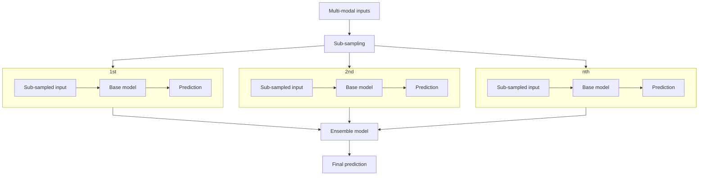

# MMCert: 针对多模态对抗攻击的可验证防御方法

<small style="color: gray; font-family: 'IBM Plex Sans SC Medium'">2025/01/13 · 周论文阅读 · 李政翱</small>

> **来源**
> 
> 此论文收录于 CVPR 2024，原文为[MMCert: Provable Defense Against Adversarial Attacks to Multi-Modal Models](https://ieeexplore.ieee.org/document/10657949).

与单模态模型不同，多模态（Multi-modal）模型的输入可以为多种不同的数据（如图像、3D点、音频和文字等）。 与单模态模型相同，现有的许多研究证明多模态模型也易受对抗样本攻击——攻击者可以在每个模态的输入中添加对抗扰动，使得多模态模型做出错误的预测。

现有的可验证防御方法大多数是为单模态的模型设计的，在扩展到多模态模型时实现了**次优的**可验证鲁棒性保证。本文提出了 MMCert 方法，是第一种针对用于多模态模型的对抗攻击防御方法。本文推导了 MMCert 方法在对抗扰动有界时的性能下界，并在多模态道路分割和多模态情绪识别两个基准测试数据集上验证了该方法。此外，还与最新的单模态对抗防御方法进行了对比，实验结果表明 MMCert 优于基线。
## 介绍

相比于单模态模型，多模态是一种更为强大的机器学习范式。多模态已被应用于许多安全关键的领域，如自动驾驶和医学成像。
### 多模态模型面对对抗攻击时的脆弱性

现有研究表明，与单模态模型一样，多模态模型也易受到对抗扰动的影响。特别地，攻击者可以同时操作多模态输入的所有模态，从而使多模态模型做出不正确的预测。

例如，在自动驾驶的**道路分割**场景中，攻击者可以对相机捕获的RGB图像和激光雷达深度传感器捕获的深度图像添加小的扰动，以降低分割质量。同样，在**视频情绪识别**的场景中，攻击者可以对视觉和音频数据进行微妙的破坏，以降低预测精度。
### 现有防御方法的局限性

现有的防御方法可以分为**经验防御**（Empirical Defense）和**可验证防御**（Certified Defense）两种。现有的研究表明大多数经验防御会被强大的自适应攻击打破，因此本文聚焦于可验证防御。

现有的认证防御主要是为单模态模型设计的。本文实验结果表明，当扩展到防御多模态模型的对抗性攻击时，它们达到了**次优**的性能。关键原因是，当攻击者添加 $l_p$ 有界扰动时，扰动后的多模态输入空间不能简单地表示为 $l_p$ 球。

### 本文工作

本文关注应用于每个模态的类似 $l_0$ 的对抗攻击（即对于每个模态的输入，增加/删除/更改一定数量的特征）。对其他攻击形式的调查留给了未来的研究。

含有 $T$ 个模态的输入 $M$ 的公式化描述如下：

$$
M=(m_1,m_2,\cdots,m_T)
$$
其中 $m_i$ 是第 $i$ 个模态的基本元素序列，如像素点、图像帧、音频帧等。

给定多模态输入 $M$ 与多模态模型 $g$ （基模型），本文方法的主要流程如下：
1. 创建多个**下采样**的多模态输入。每个下采样多模态输入是从 $m_1,m_2,\cdots,m_T$ 随机下采样 $k_1,k_2,\cdots,k_T$ 个基本元素得到的。
2. 使用多模态基模型 $g$ 在每个下采样输入的基础上作出**预测**。
3. 将预测**结果聚合**为对给定的多模态输入 $M$ 的最终预测，从而建立了一个集成多模态模型。

本文推导了上述集成多模态模型的可证明的鲁棒性保证。特别地，当 $m_1,m_2,\cdots,m_T$ 的基本元素数量不大于 $r_1,r_2,\cdots,r_T$ 时，集成多模态模型可以对多模态输入做出相同的预测。

本文分别对多模态道路分割和多模态情绪识别任务的两个基准数据集的 MMCert 进行了系统的评估。在对每个模态的输入修改有界的情况下测量了对抗性攻击下防御的性能下界。本文还将 MMCert 与最先进的单模态对抗防御方法 *随机消融* 进行了比较，实验结果表明将 MMCert 扩展到多模态模型时，它显著优于随机消融。

## 问题建模

