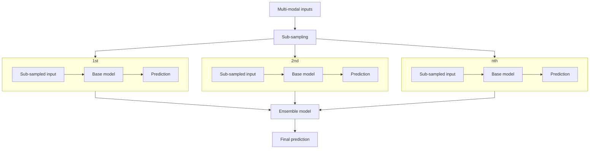

# MMCert: 针对多模态对抗攻击的可验证防御方法

<small style="color: gray; font-family: 'IBM Plex Sans SC Medium'">2025/01/13 · 周论文阅读 · 李政翱</small>

> **来源**
> 
> 此论文收录于 CVPR 2024，原文为[MMCert: Provable Defense Against Adversarial Attacks to Multi-Modal Models](https://ieeexplore.ieee.org/document/10657949).

与单模态模型不同，多模态（Multi-modal）模型的输入可以为多种不同的数据（如图像、3D点、音频和文字等）。 与单模态模型相同，现有的许多研究证明多模态模型也易受对抗样本攻击——攻击者可以在每个模态的输入中添加对抗扰动，使得多模态模型做出错误的预测。

现有的可验证防御方法大多数是为单模态的模型设计的，在扩展到多模态模型时实现了**次优的**可验证鲁棒性保证。本文提出了 MMCert 方法，是第一种针对用于多模态模型的对抗攻击防御方法。本文推导了 MMCert 方法在对抗扰动有界时的性能下界，并在多模态道路分割和多模态情绪识别两个基准测试数据集上验证了该方法。此外，还与最新的单模态对抗防御方法进行了对比，实验结果表明 MMCert 优于基线。

## 介绍

相比于单模态模型，多模态是一种更为强大的机器学习范式。多模态已被应用于许多安全关键的领域，如自动驾驶和医学成像。
### 多模态模型面对对抗攻击时的脆弱性

现有研究表明，与单模态模型一样，多模态模型也易受到对抗扰动的影响。特别地，攻击者可以同时操作多模态输入的所有模态，从而使多模态模型做出不正确的预测。

例如，在自动驾驶的**道路分割**场景中，攻击者可以对相机捕获的RGB图像和激光雷达深度传感器捕获的深度图像添加小的扰动，以降低分割质量。同样，在**视频情绪识别**的场景中，攻击者可以对视觉和音频数据进行微妙的破坏，以降低预测精度。
### 现有防御方法的局限性

现有的防御方法可以分为**经验防御**（Empirical Defense）和**可验证防御**（Certified Defense）两种。现有的研究表明大多数经验防御会被强大的自适应攻击打破，因此本文聚焦于可验证防御。

现有的认证防御主要是为单模态模型设计的。本文实验结果表明，当扩展到防御多模态模型的对抗性攻击时，它们达到了**次优**的性能。关键原因是，当攻击者添加 $l_p$ 有界扰动时，扰动后的多模态输入空间不能简单地表示为 $l_p$ 球。

### 本文工作

本文关注应用于每个模态的类似 $l_0$ 的对抗攻击（即对于每个模态的输入，增加/删除/更改一定数量的特征）。对其他攻击形式的调查留给了未来的研究。

含有 $T$ 个模态的输入 $\mathbf{M}$ 的公式化描述如下：

$$
\mathbf{M}=(\mathbf{m}_1,\mathbf{m}_2,\cdots,\mathbf{m}_T)
$$
其中 $\mathbf{m}_i$ 是第 $i$ 个模态的基本元素序列，如像素点、图像帧、音频帧等。

给定多模态输入 $\mathbf{M}$ 与多模态模型 $g$ （基模型），本文方法的主要流程如下：
1. 创建多个**下采样**的多模态输入。每个下采样多模态输入是从 $\mathbf{m}_1,\mathbf{m}_2,\cdots,\mathbf{m}_T$ 随机下采样 $k_1,k_2,\cdots,k_T$ 个基本元素得到的。
2. 使用多模态基模型 $g$ 在每个下采样输入的基础上作出**预测**。
3. 将预测**结果聚合**为对给定的多模态输入 $\mathbf{M}$ 的最终预测，从而建立了一个集成多模态模型。

本文推导了上述集成多模态模型的可证明的鲁棒性保证。特别地，当 $\mathbf{m}_1,\mathbf{m}_2,\cdots,\mathbf{m}_T$ 的基本元素数量不大于 $r_1,r_2,\cdots,r_T$ 时，集成多模态模型可以对多模态输入做出相同的预测。

本文分别对多模态道路分割和多模态情绪识别任务的两个基准数据集的 MMCert 进行了系统的评估。在对每个模态的输入修改有界的情况下测量了对抗性攻击下防御的性能下界。本文还将 MMCert 与最先进的单模态对抗防御方法 *随机消融* 进行了比较，实验结果表明将 MMCert 扩展到多模态模型时，它显著优于随机消融。

## 问题建模

该部分首先引入了威胁模型，随后定义了针对分类和分割任务的可验证对抗防御方法。

### 威胁模型

**攻击者的目标**：给定多模态输入和多模态模型，攻击者的目标是对多模态输入进行反向扰动，从而使多模态模型对被扰动的多模态输入做出错误的预测。

**攻击者的背景知识及能力**：本文假设攻击者充分了解多模态模型的体系结构和参数。考虑对多模态模型的强攻击：给定一个多模态输入，攻击者可以同时操作输入的所有模态，使得模型做出不正确的预测。

形式化定义如下：给定多模态输入 $\mathbf{M} = (\mathbf{m}_1,\mathbf{m}_2,\cdots,\mathbf{m}_T)$ ，对于第 $i$ 模态的元素序列 $\mathbf{m}_i$ ，攻击者可以任意**增加**、**删除** *或* **更改**最多 $r_i$ 个元素。

> **例外**
> 
> 对于图像而言，攻击者不能增加和删除像素值，而只能改变像素值。对于其他模态，如音频，攻击者则可以增加、删除或更改音频帧。

本文使用 $\mathcal S(\mathbf{m}_i, r_i)$ 来表示攻击者通过以上三种具体方法对 $m_i$ 的最多 $r_i$ 个元素实施对抗攻击后的所有可能的新输入 $\mathbf{m}_i^\prime$ 集合。为了简化表示，用 $\mathbf{R} = (r_1,r_2,\cdots,r_T)$ 表示对所有模态进行攻击的数量，则 $\mathcal S(\mathbf M, \mathbf R) = \mathcal S(\mathbf{m}_1,r_1) \times \mathcal S(\mathbf{m}_2,r_2) \times \cdots \times \mathcal S(\mathbf{m}_T,r_T)$ 代表生成的对抗样本 $\mathbf{M}^\prime = (\mathbf{m}_1^\prime,\mathbf{m}_2^\prime,\cdots,\mathbf{m}_T^\prime)$  的所有可能取值的集合。

### 可证明鲁棒的多模态预测
#### 分类任务

对于分类任务，假设我们有一个多模态分类模型 $G$ 。对于一个测试样本 $(\mathbf M,y)$ ，其中 $y$ 代表了真实标签，如果 $G$ 预测的标签在攻击后仍未改变，即：
$$
G(\mathbf M)=G(\mathbf M^\prime)\quad\forall\mathbf M^\prime\in\mathcal S(\mathbf M,\mathbf R)
$$
则称 $G$ 是**可证明稳定的** (Certifiably Stable)。特别地，如果 $G$ 的预测与真实标签一致，即：
$$
G(\mathbf M)=y
$$
则称 $G$ 是**可证明鲁棒的** (Certifiably Robust)。
#### 分割任务

对于分割任务，我们假定输入的其中一个模态 $\mathbf m_o$ 含有 $n_o$ 个基本元素（如像素），则多模态模型的输出包含 $n_o$ 个标签。例如，如果其中一个模态是 RGB 图像，则对于该图像的分割输出包含了对每个像素点的分割标签。

> **通俗表达**
> 
> 从工程的角度来看，如果图像分割任务的输入是一个 `[C H W]` 形状的图像张量，则其输出是一个 `[num_classes H W]` 形状的张量。

在分割任务下，可以认为多模态模型 $G$ 是由一组分类器 $G_1,G_2,\cdots,G_{n_o}$ 组成的。子分类器 $G_j$ 对 $\mathbf m_o$ 模态的第 $j$ 个元素 $\mathbf m_o^j$ 有一个预测结果，记作 $G_j(\mathbf M)$ 。真实标签也包含了 $n_o$ 个元素，记作 $y_1,y_2,\cdots,y_{n_o}$ 。如果以下条件成立：
$$
G_j(\mathbf M)=G_j(\mathbf M^\prime),\quad\forall\mathbf M^\prime\in\mathcal S(\mathbf M, \mathbf R)
$$
则称 $G_j$ 是**可证明稳定的** (Certifiably Stable)。在此基础上，如果：
$$
G_j(\mathbf M)=y_j
$$
则称 $G_j$ 是**可证明鲁棒的** (Certifiably Robust)。

通过推导可证明稳健的预测基本元素数量的*下界* ，可以保证测试样本的分割质量，通过Certified Pixel Accuracy、Certified F-score 或 Certified IoU 等指标来衡量。

## 本文设计

### 独立下采样

本文采用的下采样策略是从第 $i$ 个模态的输入 $\mathbf m_i=[m_i^1,m_i^2,\cdots,m_i^{n_i}]$ 中无替换地取出 $k_i$ 个基本元素（如像素）构成新的基本元素序列 $\mathbf z_i$ ，满足 $|\mathbf z_i|=k_i$ 。 新的随机采样多模态输入为：
$$
\mathcal Z=(\mathbf z_1,\mathbf z_2,\cdots,\mathbf z_T)
$$
这种下采样策略具有普适性，可以用于分类和分割任务。

### 聚合分类器

给定测试输入 $\mathbf M=(\mathbf m_1,\mathbf m_2,\cdots,\mathbf m_T)$ ，经过下采样得到 $\mathcal Z=(\mathbf z_1,\mathbf z_2,\cdots,\mathbf z_T)$ 。用 $g$ 表示多模态模型，则 $g(\mathcal Z)$ 表示模型在下采样后的输入 $\mathcal Z$ 上的预测。

对于任意的分类标签 $l \in {1,2,\cdots,C}$ （$C$ 是类别数），使用 $p_l$ 表示**标签概率** (Label Probability)，即：
$$
p_l=\Pr(l=g(\mathcal Z))
$$
在实际工程中，计算标签概率开销很大，因此使用蒙特卡洛下采样来计算 $p_l$ 的上界 $\overline{p_l}$ 和下界 $\underline{p_l}$ 。从 $\mathcal Z$ 中随机抽取 $N$ 个消融输入，记作 $\mathbf Z_1,\mathbf Z_2,\cdots,\mathbf Z_N$ ，其**标签频率** (Label Frequency) 为：
$$
N_l=\sum_{i=1}^N\mathbb I(g(\mathbf Z_i)=l)
$$
聚合分类器输出标签频率 $N_l$ 最大的分类 $l$ 。

> **用于分割任务的聚合分类器**
> 
> 用于分割任务的聚合分类器原理与上述聚合分类器相似。本质上，此论文将用于分割任务的多模态模型 $G$ 看作是多个分类器的集合。例如，在图像分割任务中，对于第 $j$ 个像素，聚合分类器将会输出标签频率 $N_l^j$ 最大的分类 $l$ 。

## 实验及结论

MMCert 优于现有的最先进的方法*随机消融*。对于 $r_1$ 和 $r_2$ 的所有组合，MMCert 在分类和分割两种任务上都始终优于随机消融。例如，在 RAVDESS 数据集上，当 $r1=r2=8$（攻击者可以修改 8 帧的视觉和音频模式）时，MMCert 可以保证对超过 40% 的测试样本的正确预测，而随机消融可以保证 0% 的测试样本。